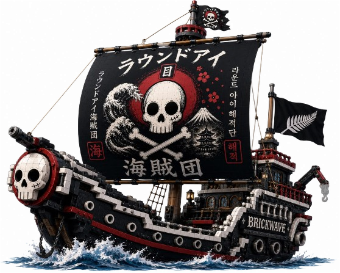

<div align="center">



# The Round Eye Pirates — FTC Team 37060

**丸い目の海賊団 · Ahoy, welcome aboard!**

Official home port of FIRST Tech Challenge Team **37060**, The Round Eye Pirates.
Charting course since July 2026 from Hawke's Bay, New Zealand.

[](https://www.firstinspires.org/robotics/ftc)
[](https://github.com/TheRoundEyePirates/Website)
[](https://astro.build)
[](https://www.typescriptlang.org)
[](https://react.dev)
[](https://tailwindcss.com)
[](https://gsap.com)
[](https://threejs.org)
[](https://vercel.com)
[](https://github.com/TheRoundEyePirates/Website/pulls)

**Live site → [round-eye-pirates.vercel.app](https://round-eye-pirates.vercel.app)**

</div>

---

## What's in the hold

A single-page pirate voyage full of treasure:

- **Compass helm** — a hand-crafted SVG compass that sways and tilts toward your cursor.
- **Captain's Log** — the robot's spec sheet plus a countdown to the next event
  (currently the **National Championship, 12–13 December 2026**).
- **The Crew** — every pirate gets their own page, photo gallery, and optional live
  FTC Scout data panel.
- **The Ship** — a full 3D model of our robot, *Raging Heaven*, rendered from a `.glb`.
- **Ship's Code** — working *and* broken code snippets, highlighted with Shiki.
- **Ship's Album** — photos and videos that auto-appear just by dropping files in a folder.
- **Tavern Tales** — a rotating quote board, a journal, a glossary, and an FAQ.
- **X marks the spot** — type `arrr` (or `treasure`, `yo ho ho`, `plunder`…) anywhere.
- A themed **404 — "Lost at Sea"** page for wayward sailors.

## Charting the course

Built as a **static Astro 7 site** with React islands, so it deploys anywhere with zero
backend and zero environment variables.

| Concern            | Tool                                               |
| ------------------ | -------------------------------------------------- |
| Framework          | [Astro](https://astro.build) 7 (static output)     |
| Islands            | [React](https://react.dev) 19 via `@astrojs/react` |
| Content            | Astro Content Collections (Content Layer API) + MDX|
| Styling            | [Tailwind CSS](https://tailwindcss.com) 4 (CSS-first) |
| Animation          | [GSAP](https://gsap.com) 3 + ScrollTrigger, [Motion](https://motion.dev) |
| 3D                 | [Three.js](https://threejs.org)                    |
| Code highlighting  | Shiki (`nord` theme)                               |
| Icons              | [lucide-react](https://lucide.dev)                 |
| Type checking      | `astro check`                                      |

## Setting sail

```bash
npm install
npm run dev        # → http://localhost:4321
```

| Command           | Description                             |
| ----------------- | --------------------------------------- |
| `npm run dev`     | Start the dev server                    |
| `npm run build`   | Static build into `dist/`               |
| `npm run preview` | Preview the production build            |
| `npm run check`   | Type-check + lint content with Astro    |
| `npm run add-code`| Scaffold a new code snippet interactively|

## The lay of the land

```
.
├── astro.config.mjs           # Astro + React + MDX + Tailwind v4 + markdown plugins
├── public/                    # favicon, FTC logo, robots.txt, 3D models
└── src/
    ├── content.config.ts      # Content Layer config: glob loaders + Zod schemas
    ├── content/               # All the words and media (see docs/content.md)
    │   ├── logs/              #   robot-log.md — spec + event countdown
    │   ├── timeline/          #   Ship's Log history entries
    │   ├── crew/              #   one folder per pirate: bio.md + photos
    │   ├── sponsors/          #   sponsor tiers
    │   ├── journal/           #   journal entries
    │   ├── code/              #   working/ and broken/ code snippets
    │   ├── MEDIA/             #   gallery — drop files in, done
    │   ├── ship/              #   robot photo
    │   └── logos/             #   light/ and dark/ logos
    ├── layouts/               # BaseLayout.astro (fonts, meta, theme script)
    ├── pages/                 # index, 404, code, crew/[key], contact, faq, sponsor…
    ├── lib/                   # build-time helpers: crew, media, code, brand, scan, 3D
    ├── components/            # React islands + .astro sections
    ├── styles/global.css      # Tailwind v4 @theme tokens, grain, prose, animations
    └── content/…
```

## Reading the map

- **[docs/](docs/README.md)** — the full map to how this ship works.
  - [Architecture](docs/architecture.md) — how pages, islands, helpers, and the
    animation engine fit together.
  - [Content](docs/content.md) — every way to add or edit content without touching code.
  - [Components](docs/components.md) — a reference for every component aboard.

## Flying colors

- Palette: sandy shore with a dune-shaded background, weathered navy, antique gold, and a
  subtle CSS grain overlay. Full **light/dark** themes with a shape-clipped view-transition toggle.
- Type: **Pirata One** (display), **Courier Prime** (headings), **IBM Plex Mono** (accents),
  **Inter** (body).
- Scroll choreography via `data-animate` / `data-stagger` / `data-parallax` attributes,
  driven by GSAP ScrollTrigger — with full `prefers-reduced-motion` support.
- Accessibility: skip link, `:focus-visible` outlines, `aria` states, keyboard-friendly
  lightbox and treasure chest, and JSON-LD structured data.

## Acknowledgments

Built for the FIRST Tech Challenge. The FIRST® and FTC logos are trademarks of FIRST —
see the footer of the live site for full attribution.
